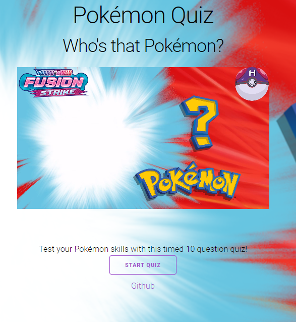

  # Pokemon-Quiz
  

  
  
  
  
  ## Description
  This is just a simple quiz to test your pokemon knowledge.  Test your knowledge, can you name them all?

  ### Tools and Languages used
  ##### Frontend:

  
  ##### Tools:

  
  
  ## Screenshots
  

  ## Contribution
Our main contributers are:

Chris Burton

Oscar Hurtado

Christopher Lee

Anthony Pottebaum

    

  

  ## Links
  GitHub Repository: https://github.com/wizzle13/Pokemon-Project

  GitHub URL: https://wizzle13.github.io/Pokemon-Project

  &copy;2022 by Chris Burton
